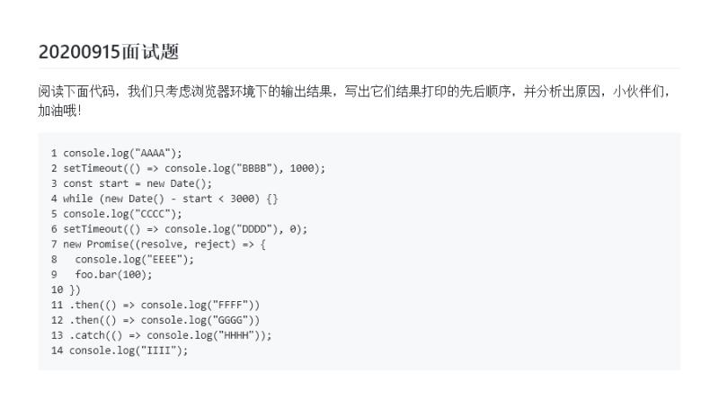

# 关于微任务宏任务简单练习

## 问题

```js
console.log('A');
setTimeout(() => console.log('B'),1000);
const start = new Date();
while(new Date() - start < 3000){};
console.log('C');
setTimeout(() => console.log('D'),0);
new Promise((resolve,reject) => {
  console.log('E');
  foo.bar(100)
})
.then(() => console.log('F'))
.then(() => console.log('G'))
.catch(() => console.log('H'))
console.log('I')
```

<!--  -->

## 思路
 
- 第一行 输出 A

- 第二行 为异步 所有 setTimeout 为宏任务，假设为t1线程放后处理

- 第四行 while 函数阻塞主线程 3s （此时t1设置的时间已经过去但主线程未结束 所以t1仍在排队

- 第五行 输出 C

- 第六行 setTimeout 也是宏任务 假设为t2 0秒为在主线程后立即执行 但是此时应仍然排在t1后

- 第七行 new Promise 为同步任务 内部会先执行 输出 E <br/> 
but 没有声明 foo.bar 所以会进入 catch 但是为微任务（在主线程完成后 不管之前排了多少个宏任务，等待了多久都直接执行

- 第十一十二行不会输出 因为没有resolve函数调用

- 第十四行 输出 I 此后进入 微任务（ 输出 H ) -> 在进入t1 -> 再进入 t2

## 答案

A -> C -> E -> I -> H -> B -> D

## 总结

> js为单线程,执行顺序为先主线程 -> 主线程中的微任务 -> 其他宏任务

> new Promise 为同步任务,内部优先执行

> while 回阻塞主线程. 在阻塞时 setTimeout 函数计时仍在继续,但是无法执行